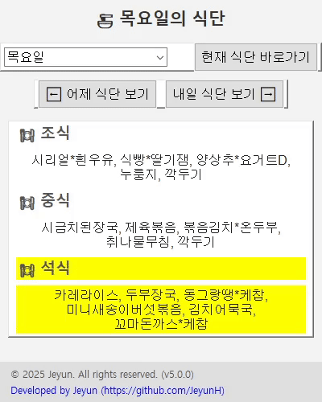

# 한국폴리텍대학 성남캠퍼스 식단표 뷰어


매번 웹사이트에 접속할 필요 없이, 데스크톱에서 간편하게 한국폴리텍대학 성남캠퍼스 학생식당의 주간 식단을 확인하는 프로그램입니다.

<br>



<br>

## 프로젝트의 목적

매일 점심, 저녁 식사를 위해 학교 웹사이트에 접속하여 식단표 게시판을 찾아 들어가는 과정은 생각보다 번거롭습니다. 특히 모바일 환경에서는 여러 번의 터치가 필요하며, PC에서도 즐겨찾기를 해두지 않았다면 불편함이 따릅니다.

이 프로젝트는 이러한 반복적인 정보 확인 과정을 자동화하고, 사용자 친화적인 GUI(그래픽 사용자 인터페이스)를 통해 **식단 정보를 가장 빠르고 직관적으로 제공하는 것**을 목표로 합니다.

- **접근성 향상**: 바탕화면의 실행 파일 하나로 즉시 식단 확인
- **시간 효율성**: 현재 시간에 맞춰 오늘 또는 내일의 식단을 자동으로 표시
- **직관적인 정보 제공**: 현재 먹을 식사(조식, 중식, 석식)를 시각적으로 강조하여 가독성 증대
- **편의 기능**: 요일 선택, 이전/다음 날 식단 보기 등 부가 기능으로 편의성 극대화

<br>

## 개발 과정: 아이디어부터 실행 파일까지

이 프로젝트는 '일상의 작은 불편함을 해결해 보자'는 간단한 생각에서 시작되었습니다. 전체 개발 과정을 문제 인식부터 최종 배포까지 단계별로 정리했습니다.

### 1단계: 문제 인식 (Problem)

> "오늘 점심 뭐 나오지?"

학생이라면 누구나 매일 하게 되는 이 질문에 답을 얻는 과정은 생각보다 번거로웠습니다.

- **반복적인 행동**: 브라우저를 열고 → 학교 홈페이지 접속 → 학생식당 메뉴로 이동 → 게시물 클릭. 이 과정을 매일 반복해야 했습니다.
- **불필요한 정보**: 식단표 하나를 보기 위해 웹사이트의 다른 정보들까지 모두 로딩해야 했습니다.
- **접근성**: PC에서는 그나마 낫지만, 모바일에서는 화면 크기와 UI 때문에 더욱 불편했습니다.

이러한 **'단순하지만 반복적인 불편함'**을 해결하고, 식단 정보에 가장 빠르게 접근할 수 있는 방법을 만드는 것이 프로젝트의 출발점이었습니다.

### 2단계: 목표 설정 및 해결 방안 탐색 (Goal & Solution)

문제 인식을 바탕으로 다음과 같은 명확한 목표를 세웠습니다.

- **목표**: "바탕화면에서 클릭 한 번으로, 지금 가장 궁금할 식단 정보를 보여주는 데스크톱 프로그램을 만들자."

이 목표를 달성하기 위한 기술 스택을 탐색했습니다.

1.  **데이터는 어디서?**: 당연히 **학교 식단표 웹사이트**가 유일한 정보 소스였습니다. 따라서 웹 페이지의 데이터를 가져오는 기술, 즉 **웹 스크레이핑(Web Scraping)**이 필수적이었습니다.
2.  **무엇으로 스크레이핑할까?**: Python 생태계에서 가장 대중적이고 사용하기 쉬운 `requests` (HTTP 요청)와 `BeautifulSoup` (HTML 파싱) 라이브러리를 선택했습니다. 복잡한 동적 페이지가 아니었기에 이 두 가지 조합만으로 충분했습니다.
3.  **어떻게 보여줄까?**: 사용자가 쉽게 사용할 수 있는 GUI(그래픽 인터페이스)가 필요했습니다. Python에서 사용할 수 있는 여러 GUI 프레임워크(PyQt, Kivy 등)가 있지만, 이 프로젝트의 목적은 '가볍고 빠른 프로그램'이었습니다. 따라서 별도의 설치가 필요 없는 Python 표준 라이브러리인 **`Tkinter`**가 가장 적합하다고 판단했습니다.

### 3단계: 핵심 기능 설계 및 구현 (Design & Implementation)

기술 스택을 확정한 뒤, 사용자의 입장에서 가장 편리할 기능을 구체적으로 설계하고 코드로 구현했습니다.

- **[구현 1] 웹 스크레이핑 엔진**:
    - `requests.get(url)`로 식단표 페이지의 전체 HTML을 가져왔습니다.
    - `BeautifulSoup(html, "html.parser")`로 가져온 HTML을 Python이 다룰 수 있는 객체로 변환했습니다.
    - 개발자 도구(F12)로 식단표가 `class="tbl_table menu"`를 가진 `<table>` 내에 있다는 것을 확인하고, `soup.find()`를 이용해 해당 테이블에 정확히 접근했습니다.
    - `for` 루프를 돌며 각 행(`<tr>`)과 열(`<td>`)의 텍스트를 추출하여 요일별 [조식, 중식, 석식] 데이터를 정리했습니다.

- **[구현 2] 스마트한 UX 설계**: 단순히 데이터를 보여주는 것을 넘어, '사용자가 지금 무엇을 원할까?'를 고민했습니다.
    - **시간 기반 자동화**: `datetime` 모듈을 활용하여 현재 시간을 가져왔습니다. 저녁 식사 시간인 18시가 지나면 사용자는 자연스럽게 '내일 아침' 메뉴를 궁금해할 것이라 판단, **18시 이후에는 자동으로 다음 날 식단을 표시**하도록 로직을 구현했습니다.
    - **시각적 강조**: 현재 시간에 맞춰 **지금 먹어야 할 식사(조식/중식/석식) 메뉴의 배경을 노란색으로 강조**했습니다. 이를 통해 사용자는 프로그램을 켜자마자 직관적으로 필요한 정보를 얻을 수 있습니다.

- **[구현 3] 성능 최적화 (캐싱)**: 날짜를 바꿀 때마다 네트워크 요청을 보내는 것은 비효율적이라고 판단했습니다.
    - 프로그램 시작 시 **단 한 번만 웹에서 데이터를 가져와 전역 변수 `cached_html`에 저장**했습니다.
    - 이후의 모든 날짜 변경, UI 갱신은 이 캐시된 데이터를 재활용하도록 하여, 불필요한 네트워크 트래픽을 없애고 매우 빠른 응답 속도를 확보했습니다.

- **[구현 4] 디테일 개선 (UI 레이아웃)**:
    - 처음에는 푸터(Footer)가 다른 위젯에 가려 보이지 않는 문제가 있었습니다. 이는 Tkinter `pack()` 관리자의 작동 방식을 이해하지 못했기 때문이었습니다. `side="bottom"` 속성을 가진 위젯을 다른 위젯들보다 **먼저 `pack()` 하여 공간을 선점**시키는 방식으로 문제를 해결했습니다.
    - 창 너비가 좁을 때 푸터 텍스트가 잘리는 문제가 추가로 발생하여, **푸터를 2단 구조로 변경**해 가독성과 안정성을 모두 확보했습니다.

### 4단계: 배포 (Deployment)

Python 개발 환경이 없는 일반 사용자도 쉽게 프로그램을 사용할 수 있도록 배포 방법을 고민했습니다.

- **문제**: `.py` 파이썬 스크립트 파일은 Python 인터프리터가 설치된 환경에서만 실행할 수 있습니다.
- **해결**: **`PyInstaller`**를 사용하여 모든 의존성 라이브러리와 소스 코드를 하나의 `.exe` 실행 파일로 패키징했습니다.
    - `--onefile`: 여러 파일을 복잡하게 전달할 필요 없이, 단 하나의 실행 파일만 배포할 수 있게 해줍니다.
    - `--windowed`: GUI 프로그램 실행 시 뒤에 나타나는 불필요한 검은색 콘솔 창을 제거하여 완성도를 높였습니다.

이 과정을 통해, 사용자는 복잡한 설치 과정 없이 다운로드한 `.exe` 파일 하나만으로 프로그램을 즉시 사용할 수 있게 되었습니다.

<br>

## 사용한 기술

- **Python 3**: 주 개발 언어
- **Tkinter**: GUI 구현을 위한 표준 라이브러리
- **Requests**: 웹 페이지 HTML 요청
- **BeautifulSoup4**: HTML 파싱 및 데이터 추출
- **PyInstaller**: Python 스크립트를 실행 파일(.exe)로 변환

<br>

## 설치 및 실행 방법

1.  **Python 3.7 이상**이 설치되어 있어야 합니다.
2.  이 저장소를 클론(Clone)하거나 다운로드합니다.
    ```bash
    git clone https://github.com/YourUsername/YourRepositoryName.git
    cd YourRepositoryName
    ```
3.  필요한 라이브러리를 설치합니다. (`requirements.txt` 파일이 필요합니다)
    ```bash
    pip install -r requirements.txt
    ```
4.  Python 스크립트를 실행합니다. (예: `meal_app.py`)
    ```bash
    python meal_app.py
    ```

> **Tip:** `requirements.txt` 파일을 프로젝트 폴더에 생성하고 아래 내용을 추가하세요.
> ```
> requests
> beautifulsoup4
> ```

<br>

## 실행 파일 (EXE) 생성 방법

`PyInstaller`를 사용하면 Python이 설치되지 않은 Windows 사용자도 프로그램을 사용할 수 있도록 단일 실행 파일을 만들 수 있습니다.

1.  PyInstaller 설치
    ```bash
    pip install pyinstaller
    ```
2.  프로젝트 폴더에서 아래 명령어 실행 (콘솔 창 없이, 하나의 파일로 생성)
    ```bash
    pyinstaller --onefile --windowed --name="성남폴리텍식단표" meal_app.py
    ```
3.  생성된 `dist` 폴더 안에 있는 `성남폴리텍식단표.exe` 파일을 실행합니다.
